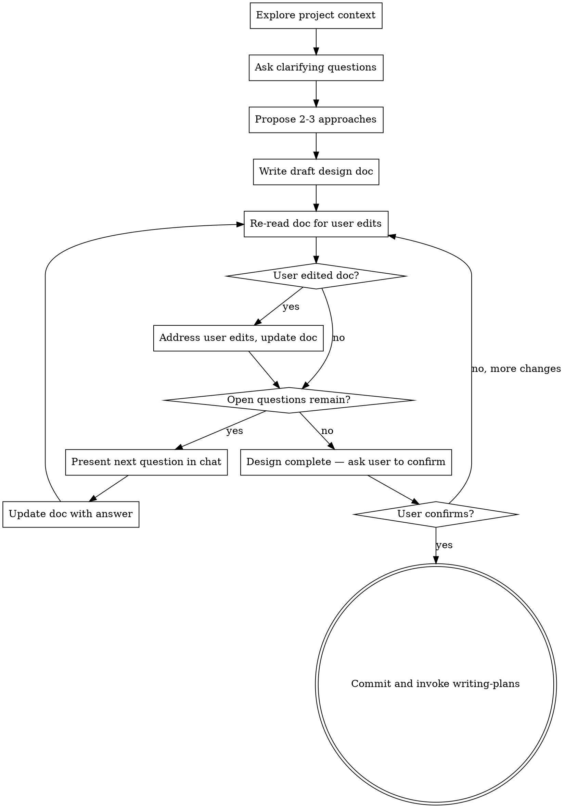

# Brainstorming Ideas Into Designs

## Overview

Help turn ideas into fully formed designs and specs through collaborative dialogue, with the design document as the living source of truth.

Start by understanding the current project context, ask questions to refine the idea, select an approach, then write a draft design doc early. Iterate on the doc through open questions and user edits until the design is complete.

<HARD-GATE>
Do NOT invoke any implementation skill, write any code, scaffold any project, or take any implementation action until the design is complete and the user has approved it. This applies to EVERY project regardless of perceived simplicity.
</HARD-GATE>

## Anti-Pattern: "This Is Too Simple To Need A Design"

Every project goes through this process. A todo list, a single-function utility, a config change — all of them. "Simple" projects are where unexamined assumptions cause the most wasted work. The design can be short (a few sentences for truly simple projects), but you MUST write it and get approval.

## Checklist

You MUST create a task for each of these items and complete them in order:

1. **Explore project context** — check files, docs, recent commits
2. **Ask clarifying questions** — one at a time, understand purpose/constraints/success criteria
3. **Propose 2-3 approaches** — with trade-offs and your recommendation
4. **Write draft design doc** — immediately after approach selection, save to `docs/plans/YYYY-MM-DD-<topic>-design.md`
5. **Iterate on design** — resolve open questions, address user edits, until design is complete
6. **Transition to implementation** — commit final design, invoke writing-plans skill

## Process Flow

**The terminal state is invoking writing-plans.** Do NOT invoke frontend-design, mcp-builder, or any other implementation skill. The ONLY skill you invoke after brainstorming is writing-plans.

## The Process

### Phase 1: Understanding (in chat)

- Check out the current project state first and create a detailed, thorough and deep understanding of the current system (files, docs, recent commits). 
- Ask questions one at a time to refine the idea
- Prefer multiple choice questions when possible, but open-ended is fine too
- Only one question per message — if a topic needs more exploration, break it into multiple questions
- Focus on understanding: purpose, constraints, success criteria

### Phase 2: Approach Selection (in chat)

- Propose 2-3 different approaches with trade-offs
- Present options conversationally with your recommendation and reasoning
- Lead with your recommended option and explain why
- Get user agreement on which approach to pursue

### Phase 3: Draft Design Doc (write to file)

Immediately after approach selection, write the design doc to `docs/plans/YYYY-MM-DD-<topic>-design.md`. This is the earliest point where the doc has a clear direction.

**The draft must contain:**
- Filled sections for what's already known (overview, chosen approach, architecture outline)
- `TBD` markers for sections that need more exploration
- An `## Open Questions` section listing all unknowns as a numbered list

**The draft does NOT need:**
- Complete answers on error handling, edge cases, testing strategy
- Final decisions on every component or data structure
- These become Open Questions

**Design sections to cover** (scale each to its complexity):
- Architecture, components, data flow, error handling, testing, e2e verification flows
- For e2e verification flows: identify the critical user path(s) to verify in the browser, what "working" looks like visually, and any Figma design references for comparison. This section feeds into the implementation plan's E2E Verification task.

### Phase 4: Iterative Refinement (document as source of truth)

The design doc is now the single source of truth. All design decisions live in the file, not in chat.

**Before each interaction, re-read the design doc.** The user may have edited it directly. This is not optional — it's how you detect user changes.

**If the user edited the doc:**
- Diff against what you last wrote
- Address the changes: update related sections for consistency, add new open questions if the edit raises them
- Tell the user in chat what you updated: "Updated the Data Flow section to reflect your changes. Added question 5 about error handling."
- If there are changes which are not clear why thet were made, present them to the user and clarify them

**For each open question:**
- Present it in chat, one at a time (as today)
- When answered, update the relevant design section and remove the question from the list
- If the answer raises new unknowns, add them to Open Questions

**The user can at any point:**
- Edit the design doc directly (Claude detects on next re-read)
- Answer questions in chat
- Add new questions to the Open Questions section
- Tell Claude to rethink a section

### Phase 5: Completion

When Open Questions is empty and all user edits are addressed:

- Ask: **"Design complete, no open questions remaining. Proceed to writing-plans?"**
- Do NOT summarize or re-present the design in chat — the file is the source of truth, the user has been reading it throughout
- If user confirms → commit the design doc, invoke writing-plans
- If user says no → back to Phase 4, re-read the doc for new edits or questions

## Key Principles

- **One question at a time** — Don't overwhelm with multiple questions
- **Multiple choice preferred** — Easier to answer than open-ended when possible
- **YAGNI ruthlessly** — Remove unnecessary features from all designs
- **Explore alternatives** — Always propose 2-3 approaches before settling
- **Doc is source of truth** — All design decisions live in the file, not in chat history
- **Re-read before each step** — Always check for user edits before proceeding
- **State what you changed** — When updating the doc, tell the user what changed in chat
- **Be flexible** — Go back and clarify when something doesn't make sense
