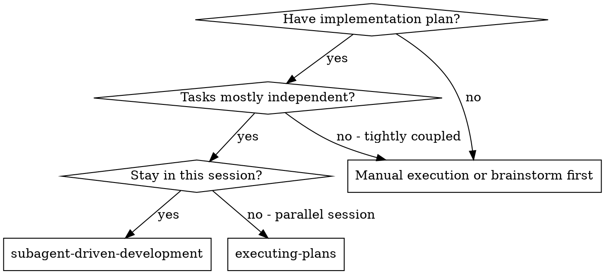
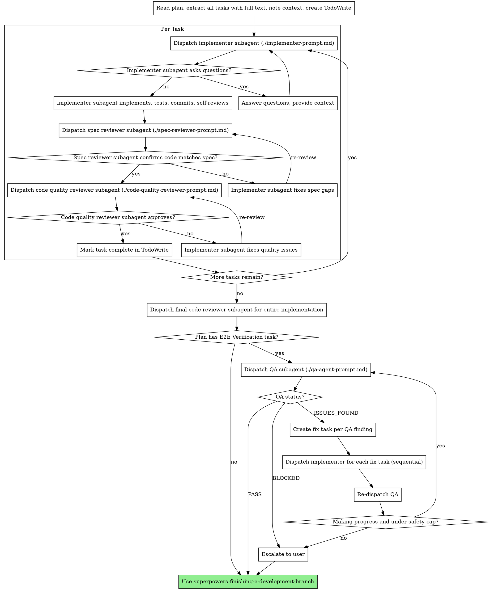

# Subagent-Driven Development

Execute plan by dispatching fresh subagent per task, with two-stage review after each: spec compliance review first, then code quality review.

**Core principle:** Fresh subagent per task + two-stage review (spec then quality) = high quality, fast iteration

## When to Use



**vs. Executing Plans (parallel session):**
- Same session (no context switch)
- Fresh subagent per task (no context pollution)
- Two-stage review after each task: spec compliance first, then code quality
- Faster iteration (no human-in-loop between tasks)

## The Process



## Orchestrator Role (HARD RULES)

You are the orchestrator. Your job is routing and coordination. You dispatch subagents, read their summaries, and decide what happens next.

**You MUST NOT:**
- Edit or write source code, test files, or configuration files
- Run tests, linters, typecheckers, or build commands
- Run any Bash command that modifies state (only read-only git commands are allowed)
- Fix issues yourself — dispatch a subagent to fix them

**You MAY:**
- Read files to understand context
- Use Glob/Grep to find files
- Run `git log`, `git status`, `git diff` (read-only git)
- Write to `docs/plans/` (plan files only)

**If you feel the urge to "just quickly fix" something, STOP. Dispatch a subagent.**

## File-Based Handoff

Subagents write detailed output to `.superpowers/reports/` and return short summaries.

**As orchestrator, you:**
1. Read the subagent's summary (under 10 lines) to make routing decisions
2. Pass the report file path to the next subagent in the chain
3. NEVER ask a subagent to repeat information that's already in a report file

**Report file naming:**
- `.superpowers/reports/task-N-implementation.md` — implementer's detailed report
- `.superpowers/reports/task-N-spec-review.md` — spec reviewer's detailed report
- `.superpowers/reports/task-N-quality-review.md` — code quality reviewer's report
- `.superpowers/reports/fix-finding-N.md` — QA agent's individual finding (N = finding number, persists across rounds)

**Before dispatching the first task**, create the reports directory and activate orchestrator mode:
```bash
mkdir -p .superpowers/reports
touch .superpowers/orchestrator-mode
```

## Prompt Templates

- `./implementer-prompt.md` - Dispatch implementer subagent
- `./spec-reviewer-prompt.md` - Dispatch spec compliance reviewer subagent
- `./code-quality-reviewer-prompt.md` - Dispatch code quality reviewer subagent
- `./qa-agent-prompt.md` - Dispatch QA subagent for e2e browser verification

## Example Workflow

```
You: I'm using Subagent-Driven Development to execute this plan.

[Read plan file once: docs/plans/feature-plan.md]
[Extract all 5 tasks with full text and context]
[Create TodoWrite with all tasks]
[mkdir -p .superpowers/reports]
[touch .superpowers/orchestrator-mode]

Task 1: Hook installation script

[Get Task 1 text and context (already extracted)]
[Dispatch implementation subagent with full task text + context]

Implementer returns summary:
  Status: DONE
  Files: src/install-hook.js, tests/install-hook.test.js
  Commit: abc1234
  Tests: 5/5 passing
  Report: .superpowers/reports/task-1-implementation.md

[Dispatch spec reviewer with task requirements + report path]
Spec reviewer returns:
  ✅ Spec compliant and system intact
  Report: .superpowers/reports/task-1-spec-review.md

[Dispatch code quality reviewer with SHAs + report paths]
Code reviewer returns:
  Strengths: Good test coverage, clean implementation
  Issues: 0 critical, 0 important, 0 minor
  Assessment: Ready to merge
  Report: .superpowers/reports/task-1-quality-review.md

[Mark Task 1 complete]

Task 2: Recovery modes

[Dispatch implementation subagent with full task text + context]

Implementer returns summary:
  Status: DONE
  Files: src/recovery.js, tests/recovery.test.js
  Commit: def5678
  Tests: 8/8 passing
  Report: .superpowers/reports/task-2-implementation.md

[Dispatch spec reviewer with task requirements + report path]
Spec reviewer returns:
  ❌ Issues: 1 spec issue, 0 integrity issues
  Report: .superpowers/reports/task-2-spec-review.md

[Dispatch implementer to fix — pass spec review report path]
Implementer returns summary:
  Status: DONE (fixes applied)
  Commit: ghi9012
  Report: .superpowers/reports/task-2-implementation-fix.md

[Re-dispatch spec reviewer]
Spec reviewer returns:
  ✅ Spec compliant and system intact

[Dispatch code quality reviewer]
...

[After all tasks]
[Dispatch final code-reviewer]
Done!

[Plan has E2E Verification task? → Yes]

E2E Verification Phase:

[Dispatch QA subagent with E2E task text, Figma refs, design doc path, plan path, finding offset 1]
QA agent returns summary:
  Status: ISSUES_FOUND
  Findings: 2
    1: .superpowers/reports/fix-finding-1.md (critical)
    2: .superpowers/reports/fix-finding-2.md (medium)

[Create 2 fix tasks in TodoWrite]

[Read fix-finding-1.md, dispatch implementer with systematic-debugging]
Implementer returns:
  Status: DONE
  Commit: abc1234

[Read fix-finding-2.md, dispatch implementer with systematic-debugging]
Implementer returns:
  Status: DONE — ALREADY_RESOLVED (previous fix resolved this too)

[Re-dispatch QA with finding offset 3]
QA agent returns summary:
  Status: PASS
  Verified: Form submission, success toast, redirect

[Proceed to finishing-a-development-branch]
```

## E2E Verification Phase

After the final code review and before finishing-a-development-branch, check if the plan contains an E2E Verification task.

**Orchestrator responsibilities:**

1. Check if the plan has an E2E Verification task. If not, skip to finishing-a-development-branch.
2. Initialize finding number offset to 1.
3. Dispatch QA subagent using `./qa-agent-prompt.md`. Provide: E2E task text, Figma references, design doc path, implementation plan path, finding number offset.
4. Read QA summary:
   - PASS → proceed to finishing-a-development-branch
   - BLOCKED → report to user (environment likely not running), proceed to finishing-a-development-branch
   - ISSUES_FOUND → continue to step 5
5. Read finding file paths from QA summary. Create one fix task per finding in TodoWrite.
6. For each fix task (sequentially):
   - Read the finding file
   - Dispatch implementer using `./implementer-prompt.md` with the fix task template (see below)
   - All fix tasks get systematic-debugging — no exceptions
   - Do NOT dispatch spec reviewer or code quality reviewer for fix tasks
   - If implementer reports ALREADY_RESOLVED, mark task complete and move on
7. After all fix tasks complete, update the finding number offset (previous offset + number of findings from last QA round).
8. Progress check: compare current QA finding count against previous round.
   - Fewer findings or different issues → making progress, re-dispatch QA (loop to step 3)
   - Same finding count with same descriptions → stuck, escalate to user with finding file paths
9. Safety cap: after 3 total QA dispatches, escalate to user regardless. This provides 2 fix rounds.

### Fix task dispatch template

When dispatching an implementer for a fix task, fill the implementer prompt's Task Description section with:

```
## Task Description

Fix an issue found during e2e QA verification.

[CONTENTS OF fix-finding-N.md pasted here]

## Context

This is a fix task from e2e QA. The feature is implemented but QA found
issues in the browser.

- Design doc: [path]
- Implementation plan: [path]

You MUST use the systematic-debugging skill to investigate before fixing.
Do NOT patch symptoms. Find the root cause.

If you cannot reproduce the issue after initial investigation, report
ALREADY_RESOLVED and move on. Do not force a fix for a non-existent problem.
```

## Advantages

**vs. Manual execution:**
- Subagents follow TDD naturally
- Fresh context per task (no confusion)
- Parallel-safe (subagents don't interfere)
- Subagent can ask questions (before AND during work)

**vs. Executing Plans:**
- Same session (no handoff)
- Continuous progress (no waiting)
- Review checkpoints automatic

**Efficiency gains:**
- No file reading overhead (controller provides full text)
- Controller curates exactly what context is needed
- Subagent gets complete information upfront
- Questions surfaced before work begins (not after)

**Quality gates:**
- Self-review catches issues before handoff
- Two-stage review: spec compliance, then code quality
- Review loops ensure fixes actually work
- Spec compliance prevents over/under-building
- Code quality ensures implementation is well-built

**Cost:**
- More subagent invocations (implementer + 2 reviewers per task)
- Controller does more prep work (extracting all tasks upfront)
- Review loops add iterations
- But catches issues early (cheaper than debugging later)

## Red Flags

**Never:**
- Start implementation on main/master branch without explicit user consent
- Skip reviews (spec compliance OR code quality)
- Proceed with unfixed issues
- Dispatch multiple implementation subagents in parallel (conflicts)
- Make subagent read plan file (provide full text instead)
- Skip scene-setting context (subagent needs to understand where task fits)
- Ignore subagent questions (answer before letting them proceed)
- Accept "close enough" on spec compliance (spec reviewer found issues = not done)
- Skip review loops (reviewer found issues = implementer fixes = review again)
- Let implementer self-review replace actual review (both are needed)
- **Start code quality review before spec compliance is ✅** (wrong order)
- Move to next task while either review has open issues
- Skip e2e verification when plan includes an E2E Verification task (every phase matters)
- Browse the app yourself as orchestrator (dispatch QA subagent instead)
- Dispatch spec/code-quality reviewers for fix tasks (re-QA is the verification)
- Fix QA findings yourself instead of dispatching implementer subagents
- Delete finding files between QA rounds (they persist for the record)

**If subagent asks questions:**
- Answer clearly and completely
- Provide additional context if needed
- Don't rush them into implementation

**If reviewer finds issues:**
- Implementer (same subagent) fixes them
- Reviewer reviews again
- Repeat until approved
- Don't skip the re-review

**If subagent fails task:**
- Dispatch fix subagent with specific instructions
- Don't try to fix manually (context pollution)

## Integration

**Required workflow skills:**
- **superpowers:using-git-worktrees** - REQUIRED: Set up isolated workspace before starting
- **superpowers:writing-plans** - Creates the plan this skill executes
- **superpowers:requesting-code-review** - Code review template for reviewer subagents
- **superpowers:finishing-a-development-branch** - Complete development after all tasks

**Subagents should use:**
- **superpowers:test-driven-development** - Subagents follow TDD for each task

**Alternative workflow:**
- **superpowers:executing-plans** - Use for parallel session instead of same-session execution
